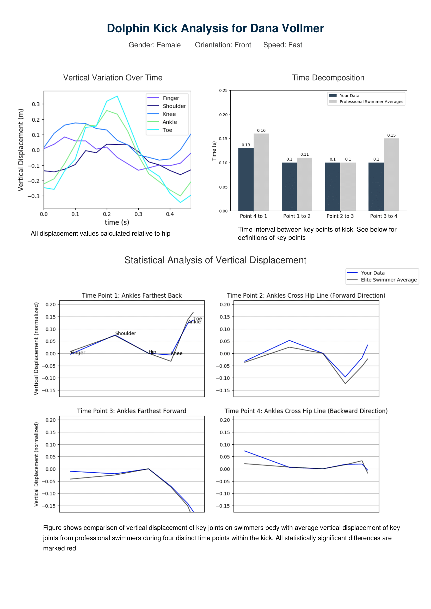
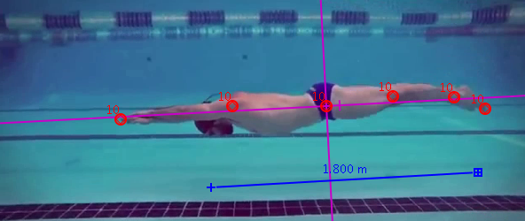

# dolphinkick_analysis

## Main Function

Analyzes differences in a swimmer's dolphin kick technique compared to elite swimmers.

Input is a data table of y-coordinates of the joints on a swimmer performing dolpihin kick (created using [Tracker software](https://physlets.org/tracker/)). Output is a PDF file containing three graphs describing the data. The graphs are as follows:

1. Vertical displacement (y-coordinates) of joints on the swimmers body throughout one complete cycle of kick.
2. Time between each of four established key points of the kick cycle (See "Program Logic" for description of key points). Graph shows comparison between your data and library of elite swimmer data.
3. Comparison of vertical displacement of swimmer's joints with average from elite swimmer library. Data is shown at each of four key points of the kick cycle.

## Example Output

Here is an example of the report the script outputs.



## Running the Software

To run the program type the following into terminal:
```
python3 dolphin.py
```

The software will ask you a series of questions about your gender<sup>1</sup>, orientation while performing the dolphin kick, and the speed at which you were performing it. These questions are to select an equivelant subset of data from the database of elite swimmers to compare to.

<sup>1:"Gender" here refers to the binary category in which you compete in swimming. While gender does not exist on this exclusive binary, at this time, there are only two categories for "gender" in athletics: Male and Female. For the sake of more accurate physical comparisons, that is the classification that is used.</sup>

Please have the following installed to run the program:

* sys
* numbers
* pandas
* numpy
* scipy

Use the following command to import these packages if you do not have them installed
```
pip3 install {package name}
```

## How the Software Works

### Creating the Input File

The input file is an excel file containing a data table with the y-coordinates of six key joints on the swimmer throughout one full cycle of dolphin kick. The designated beginning is when the ankles are at the farthest back position in the kick. Make sure the ankles are at least behind the hips at time 1. The program will automatically detect the farthest back position.

The data table should look as follows:

| t      | Finger | Shoulder | Hip | Knee | Ankle | Toe |
|--------|--------|----------|-----|------|-------|-----|
| time 1 |        |          |     |      |       |     |
| time 2 |        |          |     |      |       |     |
| time 3 |        |          |     |      |       |     |

The easiest way to create this table is using the free online software [Tracker](https://physlets.org/tracker/). 

In order to keep values relative to the swimmer's location in the frame, the hips are designated as the origin of the x,y-plane. The angle of the x-axis is designated as the straight line that represents the best fit to all points on the swimmers body when the swimmer is at her most straight position.

The height of the swimmer is used to scale measurements.

The image below represents the proper set-up.




<br>

### Elite Swimmer Library

The program contains a library of data representing dolphin kick technique from elite swimmers as a pandas dataframe. This library was created using the processog.py file included in this repository. This script asks for an excel file (same format as above) as an input and outputs a printed version of the dataframe that can then be copy and pasted into Library.py to be referenced as a comparison.

Four key time points are computed for every elite swimmer's data, and only these timepoints are used in comparison and stored. See below for explanation of the key time points.

Use the following command to create an input for the Library dataframe:

```
python3 processog.py {swimmer name} {gender} {orientation} {speed} {swimmer's height}
```
<br>

### Program Logic

When run the program follows these processing steps:

1. The inputted parameters (gender, orientation and speed) are used to filter the elite swimmer data so only equivalent comparisons are made. 

2. The mean and variance of the filtered elite swimmer data is computed for each joint and each time point.

3. Four key time points based on specific positions during the dolphin kick are computed. The key time points are:

      * Key 1: Ankles are at farthest backwards position during the kick
      * Key 2: Ankles cross the midline in a forward direction
      * Key 3: Ankles are at farthest forward position during the kick
      * Key 4: Ankles cross the midline in a backward direction
      
4. The time between these four key points is computed

5. All y-values are normalized to the height of the swimmer.

6. The y-values at each of the key time points are compared to the filtered elite swimmer data for each joint an p-values are computed.

7. The three graphs are created and saved as png files. 

8. A PDF file is created that includes the three graphs and is formatted with comprehensive spacing and labels. 


